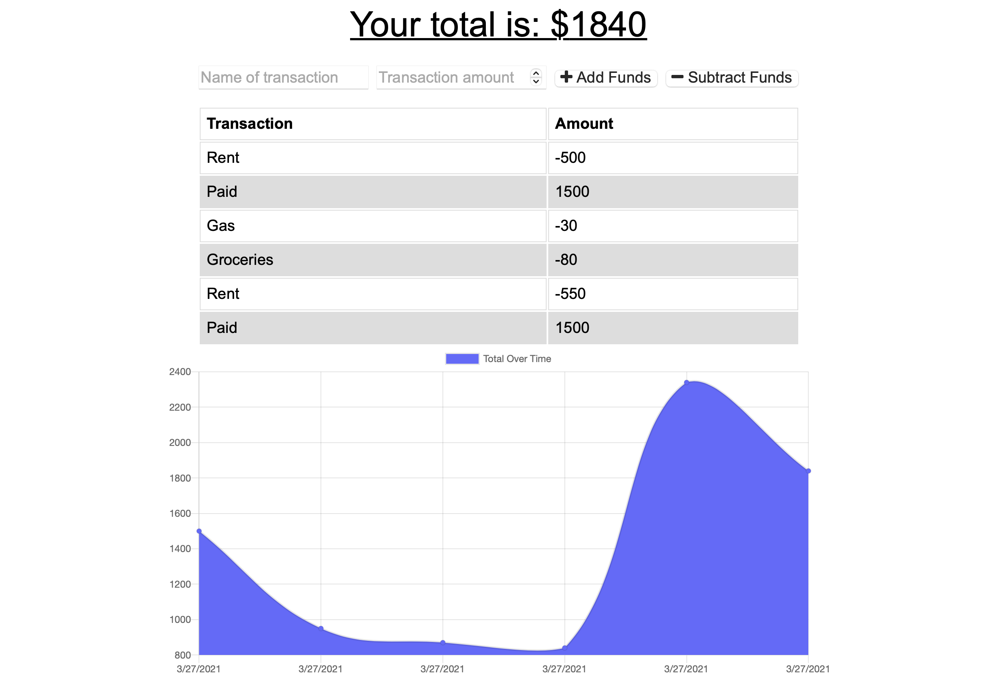

# BudgetTracker

## Description
This app allows a user to track and save their budget. The data is stored using MongoDB Atlas and the app is deployed on Heroku. This is also a demonstration of a progressive web app (PWA), allowing the user to download the app and use it while offline.

## Table of Contents

1. [Screenshot](#screenshot)
2. [Usage](#usage)
3. [Questions](#questions)

## Screenshot

## Usage

To use, simply navigate to the site and start entering budget information! [Link](https://budgettracker-pwa-cw.herokuapp.com)

## Questions

You can find my Github user profile [here.](https://github.com/Calebkw91)
I can be reached by email at walke1291@gmail.com